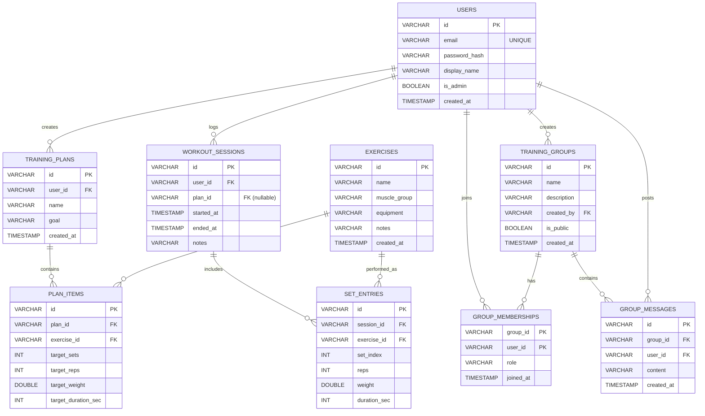

# ER 图（中文）

> 说明：为便于演示与灵活迁移，数据库层面可以不强制外键约束；但逻辑关系在 ER 图中仍按外键语义表达。

## 解释

### 实体说明

* `USERS`：系统用户账号信息。

* `EXERCISES`：动作库条目（名称、肌群、器械、说明）。

* `TRAINING_PLANS`：训练计划，属于某个用户（`user_id`）。

* `PLAN_ITEMS`：计划条目，表示“计划包含哪些动作以及目标指标”。

* `WORKOUT_SESSIONS`：一次训练记录（训练会话），属于某个用户，可选关联一个计划（`plan_id` 可为空）。

* `SET_ENTRIES`：训练会话中的组次记录，属于某个会话（`session_id`），并关联具体动作（`exercise_id`）。

### 关系与基数

* `USERS` 1 — N `TRAINING_PLANS`：一个用户可以创建多个训练计划。

* `USERS` 1 — N `WORKOUT_SESSIONS`：一个用户可以记录多次训练。

* `TRAINING_PLANS` 1 — N `PLAN_ITEMS`：一个计划包含多个计划条目。

* `EXERCISES` 1 — N `PLAN_ITEMS`：一个动作可以出现在多个计划条目中。

* `WORKOUT_SESSIONS` 1 — N `SET_ENTRIES`：一次训练会话包含多条组次记录。

* `EXERCISES` 1 — N `SET_ENTRIES`：一个动作可以在多条组次记录中被引用。

（可选）群组相关：

* `USERS` 1 — N `TRAINING_GROUPS`：一个用户可创建多个群组。

* `TRAINING_GROUPS` 1 — N `GROUP_MEMBERSHIPS`：一个群组包含多名成员。

* `USERS` 1 — N `GROUP_MEMBERSHIPS`：一个用户可以加入多个群组。

* `TRAINING_GROUPS` 1 — N `GROUP_MESSAGES`：一个群组有多条消息。

* `USERS` 1 — N `GROUP_MESSAGES`：一个用户可以在群组中发布多条消息。

### 关键约束（建议）

* `USERS.email`：唯一约束。

* `PLAN_ITEMS`：同一计划内可允许同一动作出现多次（用于不同目标阶段），是否限制由业务决定。

* `SET_ENTRIES.set_index`：用于标识某动作在一次会话中的第几组，建议在同一 `session_id` + `exercise_id` 范围内保持从 1 递增。

（可选）群组相关：

* 仅管理者可创建群组：建议在应用层通过 `USERS.is_admin = true` 做权限校验；普通用户不可调用“创建群组”能力。

* `TRAINING_GROUPS.name`：建议在全局或“创建者范围内”保持唯一，按需求选择。

* `GROUP_MEMBERSHIPS`：使用复合主键（`group_id`,`user_id`）避免重复加入。

* `GROUP_MESSAGES.content`：只做纯文本（例如 2000 字以内），避免上传等复杂度。

### 为什么要拆成这些表

* `TRAINING_PLANS` 与 `WORKOUT_SESSIONS`：计划是“打算怎么练”，会话是“实际怎么练”。实际训练经常偏离计划（重量/次数/组数变化），所以记录应落在会话与组次里，而不是修改计划本身。

* `PLAN_ITEMS` 与 `SET_ENTRIES`：二者都是明细表，但保存的信息不同：计划条目保存“目标”，组次记录保存“真实数据”。拆开后更利于复用计划、做统计（总训练量、历史 PR）、以及未来扩展（RPE、心率、路线等）。

* 范式与查询：把“一对多”的内容拆到明细表，避免在单表里出现重复列/数组字段；索引与聚合查询更直接。

### 一个直观例子

* 计划：`Push Day`（`TRAINING_PLANS` 一条）
  * 卧推 目标 3×5（`PLAN_ITEMS` 一条）
  * 俯卧撑 目标 3×12（`PLAN_ITEMS` 一条）

* 今天实际训练：`2026-04-07`（`WORKOUT_SESSIONS` 一条，可选关联该计划）
  * 卧推：60×5、60×5、57.5×5（`SET_ENTRIES` 三条）
  * 俯卧撑：12、10、8（`SET_ENTRIES` 三条）

***

# ER Diagram (English)

> Note: For demo flexibility, the database may omit hard foreign-key constraints; however, logical relationships are still modeled as FK semantics in this ER diagram.

## Explanation

### Entities

* `USERS`: user accounts.

* `EXERCISES`: exercise library items (name, muscle group, equipment, notes).

* `TRAINING_PLANS`: a training plan owned by a user (`user_id`).

* `PLAN_ITEMS`: plan items describing which exercises are included and their targets.

* `WORKOUT_SESSIONS`: a logged workout session owned by a user; optionally linked to a plan (`plan_id` nullable).

* `SET_ENTRIES`: set-by-set logs within a session, linked to a session (`session_id`) and an exercise (`exercise_id`).

### Relationships & Cardinalities

* `USERS` 1 — N `TRAINING_PLANS`: one user can create many plans.

* `USERS` 1 — N `WORKOUT_SESSIONS`: one user can log many sessions.

* `TRAINING_PLANS` 1 — N `PLAN_ITEMS`: one plan contains many items.

* `EXERCISES` 1 — N `PLAN_ITEMS`: one exercise can appear in many plan items.

* `WORKOUT_SESSIONS` 1 — N `SET_ENTRIES`: one session contains many set entries.

* `EXERCISES` 1 — N `SET_ENTRIES`: one exercise can be referenced by many set entries.

(Optional) Group-related:

* `USERS` 1 — N `TRAINING_GROUPS`: one user can create many groups.

* `TRAINING_GROUPS` 1 — N `GROUP_MEMBERSHIPS`: one group has many members.

* `USERS` 1 — N `GROUP_MEMBERSHIPS`: one user can join many groups.

* `TRAINING_GROUPS` 1 — N `GROUP_MESSAGES`: one group contains many messages.

* `USERS` 1 — N `GROUP_MESSAGES`: one user can post many messages.

### Key Constraints (Recommended)

* `USERS.email`: unique.

* `PLAN_ITEMS`: allowing the same exercise multiple times in one plan is a business choice (e.g., different phases/targets).

* `SET_ENTRIES.set_index`: identifies the set number; recommended to be 1..N within the same `session_id` + `exercise_id` scope.

(Optional) Group-related:

* Admin-only creation: enforce at application level via `USERS.is_admin = true`; regular users cannot create groups.

* `TRAINING_GROUPS.name`: keep it unique globally or within the creator scope, depending on requirements.

* `GROUP_MEMBERSHIPS`: composite primary key (`group_id`,`user_id`) prevents duplicate membership.

* `GROUP_MESSAGES.content`: keep it text-only (e.g., <= 2000 chars) to avoid upload complexity.

### Why These Tables Are Separated

* `TRAINING_PLANS` vs `WORKOUT_SESSIONS`: a plan is “what you intend to do”, while a session is “what actually happened”. Real workouts often deviate from targets (weight/reps/sets), so the deviation should live in sessions/sets instead of mutating the plan.

* `PLAN_ITEMS` vs `SET_ENTRIES`: both are detail tables, but they store different details. Plan items store targets; set entries store actual measurements. This supports plan reuse, clean analytics (volume, history/PR), and future extensions (RPE, heart rate, routes, etc.).

* Normalization & querying: modeling one-to-many details as separate tables avoids duplicated columns/array-like fields in a single table and makes indexing and aggregations simpler.

### A Concrete Example

* Plan: `Push Day` (one row in `TRAINING_PLANS`)
  * Bench press target 3×5 (one row in `PLAN_ITEMS`)
  * Push-ups target 3×12 (one row in `PLAN_ITEMS`)

* Actual workout on `2026-04-07` (one row in `WORKOUT_SESSIONS`, optionally linked to the plan)
  * Bench press: 60×5, 60×5, 57.5×5 (three rows in `SET_ENTRIES`)
  * Push-ups: 12, 10, 8 (three rows in `SET_ENTRIES`)
