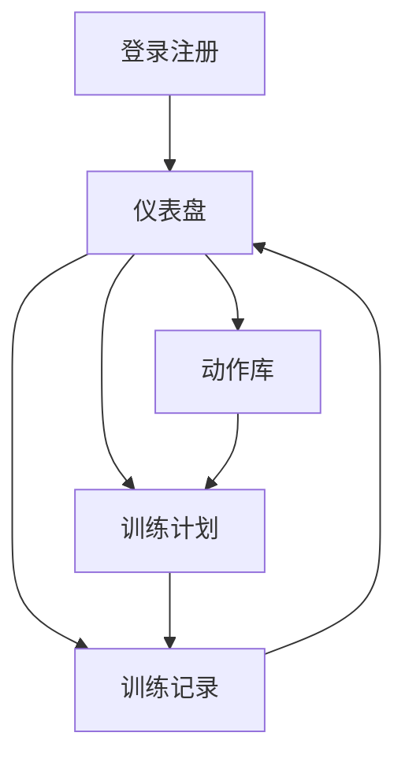
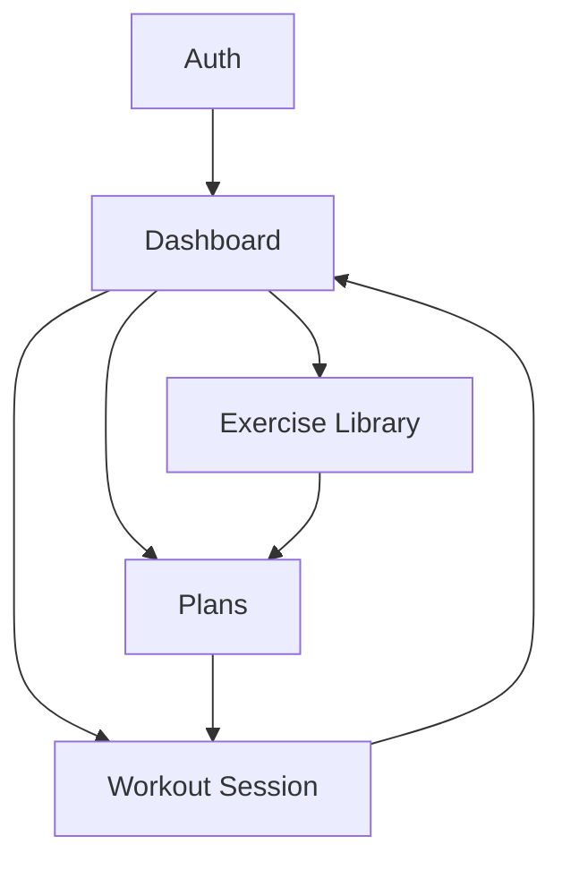

## 中文版 PRD

### 1. 产品概述
一个用于管理训练计划与训练记录的体能训练系统，面向个人训练者，帮助把“计划→执行→复盘”形成闭环。

### 2. 核心功能

#### 2.1 用户角色
| 角色 | 注册方式 | 核心权限 |
|---|---|---|
| 用户 | 邮箱密码 | 创建计划、记录训练、查看进度 |

#### 2.2 功能模块（核心页面）
1. **登录/注册页**：登录、注册、退出入口。
2. **首页/仪表盘**：今日训练入口、最近训练、基础统计。
3. **动作库页**：动作列表、搜索筛选、动作详情。
4. **训练计划页**：计划列表、创建/编辑计划、计划条目管理。
5. **训练记录页**：开始训练、按动作记录组次、提交保存。

（可选）6. **群组讨论页**：浏览群组、加入/退出、群内发布消息与查看消息列表。

#### 2.3 页面明细
| 页面 | 模块 | 功能描述 |
|---|---|---|
| 登录注册 | 身份认证 | 完成注册、登录、退出；成功后跳转到仪表盘。 |
| 首页仪表盘 | 快速开始 | 显示“开始训练”入口；若选择计划则带入动作清单。 |
| 首页仪表盘 | 最近与统计 | 展示最近训练记录列表与基础汇总（次数/总训练量/时长）。 |
| 动作库 | 浏览与搜索 | 展示动作列表；支持关键字搜索与基础筛选（肌群/器械）。 |
| 动作库 | 动作详情 | 查看动作说明与注意事项。 |
| 训练计划 | 计划 CRUD | 创建/编辑/删除计划；设置计划名称与目标。 |
| 训练计划 | 计划条目 | 为计划添加动作与目标组次（组数/次数/重量或时长）。 |
| 训练记录 | 训练流程 | 创建一次训练；选择计划（可选）；完成后提交保存。 |
| 训练记录 | 组次记录 | 按动作录入多组数据（次数、重量、用时）；支持增删改组。 |

### 3. 核心流程
- 注册或登录 → 进入仪表盘 →（可选）浏览动作库了解动作 → 创建训练计划 → 在仪表盘点击开始训练 → 记录每个动作的组次 → 提交保存 → 回到仪表盘查看最近训练与统计。

### 4. 可选功能：训练群组（简化版）

#### 4.1 目标
- 让训练习惯相近的人加入同一个群组，并在群内用文字交流。

#### 4.2 最小功能范围（不做复杂社交）
- 群组：公开群组列表、查看群组详情。
- 创建：仅“管理者账号”可以创建群组；普通用户不可创建。
- 成员：加入/退出群组；展示成员数（可选）。
- 讨论：发消息、查看按时间排序的消息列表（不做回复层级/不做私信）。

#### 4.3 明确不做
- 不做群邀请/审批流程；不提供完整的管理员后台（可通过初始化数据/数据库配置管理者账号）。
- 不做点赞、图片/文件上传、@提醒。
- 不做复杂权限（默认群内消息仅成员可见）。

---

## English PRD

### 1. Product Overview
This is a fitness training system for managing training plans and workout logs. It targets individual trainees and closes the loop: plan → execute → review.

### 2. Core Features

#### 2.1 User Roles
| Role | Registration Method | Core Permissions |
|---|---|---|
| User | Email + Password | Create plans, log workouts, view progress |

#### 2.2 Feature Modules (Core Pages)
1. **Auth**: sign in, sign up, sign out entry.
2. **Dashboard**: start today’s workout, recent sessions, basic stats.
3. **Exercise Library**: list, search/filter, exercise details.
4. **Plans**: plan list, create/edit plans, manage plan items.
5. **Workout Session**: start a session, log sets per exercise, submit/save.

(Optional) 6. **Group Discussion**: browse groups, join/leave, post messages and read the timeline.

#### 2.3 Page Details
| Page | Module | Feature Description |
|---|---|---|
| Auth | Authentication | Register, sign in/out; redirect to dashboard after success. |
| Dashboard | Quick Start | Provide “Start workout”; optionally pick a plan to preload exercise list. |
| Dashboard | Recent & Stats | Show recent sessions and simple aggregates (count/volume/duration). |
| Exercise Library | Browse & Search | Browse the list; keyword search and basic filters (muscle group/equipment). |
| Exercise Library | Exercise Details | View instructions and notes. |
| Plans | Plan CRUD | Create/edit/delete plans; set plan name and goal. |
| Plans | Plan Items | Add exercises and set target sets/reps/weight or duration. |
| Workout Session | Session Lifecycle | Create a session; optionally choose a plan; submit and save. |
| Workout Session | Set Logging | Enter multiple sets (reps/weight/duration); add/edit/delete sets. |

### 3. Core Process
- Sign up or sign in → dashboard → (optional) browse exercises → create a plan → start a workout from dashboard → log sets → submit/save → return to dashboard for recent sessions and stats.

### 4. Optional Feature: Training Groups (Minimal)

#### 4.1 Goal
- Allow users with similar habits to join a group and chat via plain text.

#### 4.2 Minimal Scope (no complex social features)
- Groups: list public groups, view group details.
- Creation: only “manager/admin accounts” can create groups; regular users cannot.
- Membership: join/leave; show member count (optional).
- Discussion: post messages and read a time-ordered feed (no threaded replies/DM).

#### 4.3 Explicitly Out of Scope
- No invitations/approval flows; no full admin console (admin accounts can be configured via seed/DB setup).
- No likes, image/file uploads, or @mentions.
- No complex permissions (messages visible to members only by default).
