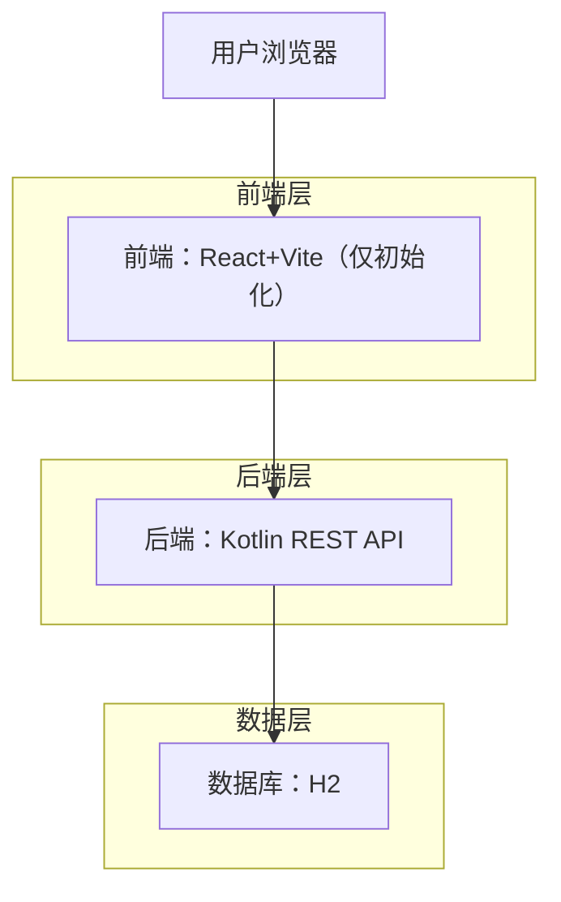
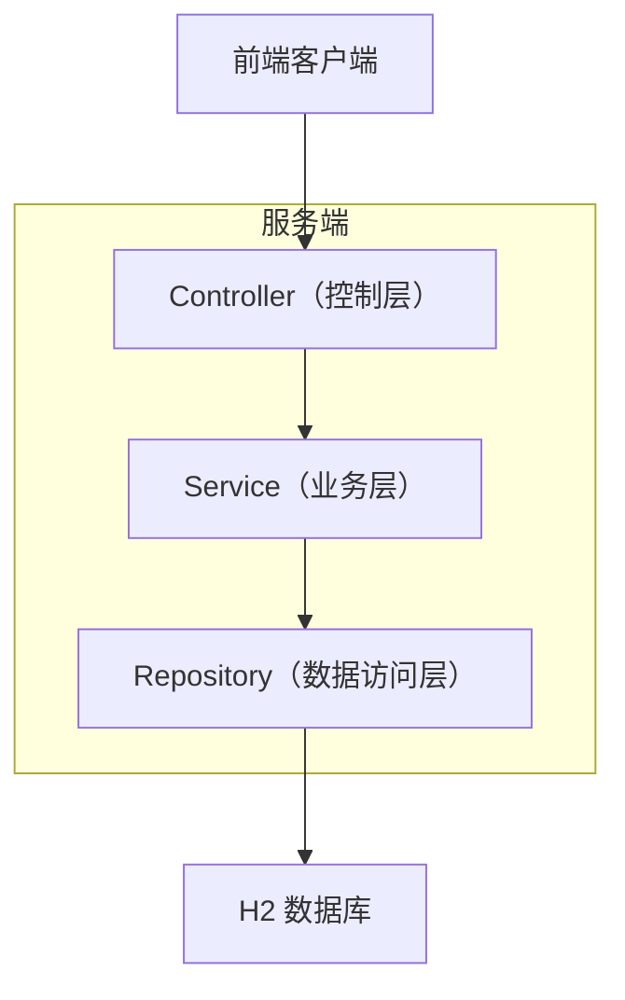
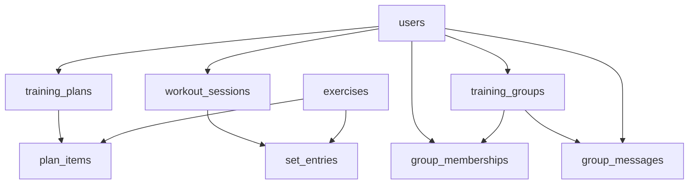
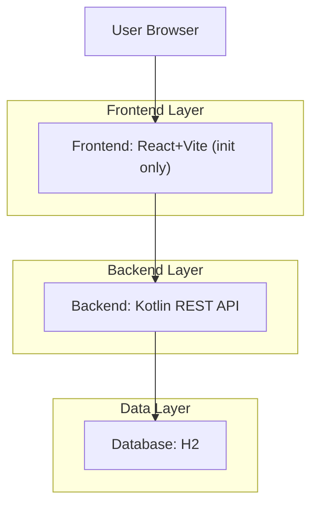
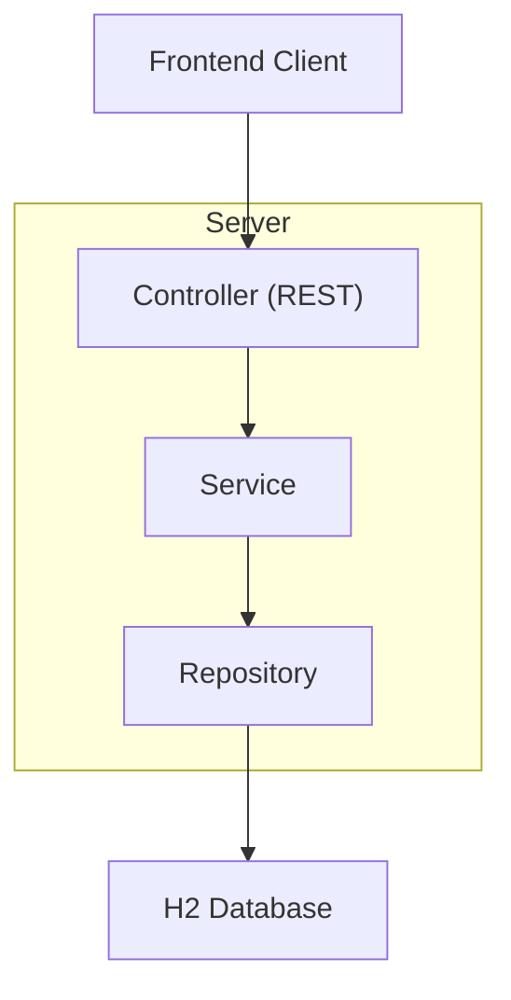

## 中文版：技术架构

### 1. 架构设计


### 2. 技术选型说明
- 前端：React@18 + Vite + react-router-dom（仅初始化与路由骨架）。
- 后端：Kotlin + Spring Boot（REST API）。
- 数据库：H2（嵌入式，开发/演示）。

### 3. 路由定义（前端）
| 路由 | 用途 |
|---|---|
| /login | 登录 |
| /register | 注册 |
| / | 仪表盘 |
| /exercises | 动作库 |
| /plans | 训练计划 |
| /workouts/new | 开始训练 |

### 4. API 定义

#### 4.1 核心类型（前后端共享结构）
```ts
export type User = { id: string; email: string; displayName: string; createdAt: string };
export type Exercise = { id: string; name: string; muscleGroup: string; equipment?: string; notes?: string; createdAt: string };
export type TrainingPlan = { id: string; userId: string; name: string; goal?: string; createdAt: string };
export type PlanItem = { id: string; planId: string; exerciseId: string; targetSets?: number; targetReps?: number; targetWeight?: number; targetDurationSec?: number };
export type WorkoutSession = { id: string; userId: string; planId?: string; startedAt: string; endedAt?: string; notes?: string };
export type SetEntry = { id: string; sessionId: string; exerciseId: string; setIndex: number; reps?: number; weight?: number; durationSec?: number };
```

#### 4.2 REST 接口（MVP）
- 认证
  - POST /api/auth/register
  - POST /api/auth/login
  - POST /api/auth/logout
- 动作
  - GET /api/exercises?query=&muscleGroup=&equipment=
  - GET /api/exercises/:id
- 计划
  - GET /api/plans
  - POST /api/plans
  - PUT /api/plans/:id
  - DELETE /api/plans/:id
  - GET /api/plans/:id/items
  - POST /api/plans/:id/items
  - DELETE /api/plan-items/:id
- 训练
  - POST /api/workout-sessions
  - GET /api/workout-sessions?from=&to=
  - POST /api/workout-sessions/:id/sets
  - PUT /api/sets/:id
  - DELETE /api/sets/:id

#### 4.3 可选：群组（简化版）
- 群组
  - GET /api/groups
  - POST /api/groups（仅管理者）
  - GET /api/groups/:id
  - POST /api/groups/:id/join
  - POST /api/groups/:id/leave
- 群消息
  - GET /api/groups/:id/messages?before=&limit=
  - POST /api/groups/:id/messages

### 5. 服务端分层图


### 6. 数据模型

#### 6.1 数据模型关系图


#### 6.2 DDL（表结构）
```sql
CREATE TABLE users (
  id VARCHAR(36) PRIMARY KEY,
  email VARCHAR(255) NOT NULL UNIQUE,
  password_hash VARCHAR(255) NOT NULL,
  display_name VARCHAR(100) NOT NULL,
  is_admin BOOLEAN DEFAULT FALSE,
  created_at TIMESTAMP DEFAULT CURRENT_TIMESTAMP
);

CREATE TABLE exercises (
  id VARCHAR(36) PRIMARY KEY,
  name VARCHAR(120) NOT NULL,
  muscle_group VARCHAR(60) NOT NULL,
  equipment VARCHAR(60),
  notes VARCHAR(2000),
  created_at TIMESTAMP DEFAULT CURRENT_TIMESTAMP
);

CREATE TABLE training_plans (
  id VARCHAR(36) PRIMARY KEY,
  user_id VARCHAR(36) NOT NULL,
  name VARCHAR(120) NOT NULL,
  goal VARCHAR(500),
  created_at TIMESTAMP DEFAULT CURRENT_TIMESTAMP
);

CREATE TABLE plan_items (
  id VARCHAR(36) PRIMARY KEY,
  plan_id VARCHAR(36) NOT NULL,
  exercise_id VARCHAR(36) NOT NULL,
  target_sets INT,
  target_reps INT,
  target_weight DOUBLE,
  target_duration_sec INT
);

CREATE TABLE workout_sessions (
  id VARCHAR(36) PRIMARY KEY,
  user_id VARCHAR(36) NOT NULL,
  plan_id VARCHAR(36),
  started_at TIMESTAMP NOT NULL,
  ended_at TIMESTAMP,
  notes VARCHAR(2000)
);

CREATE TABLE set_entries (
  id VARCHAR(36) PRIMARY KEY,
  session_id VARCHAR(36) NOT NULL,
  exercise_id VARCHAR(36) NOT NULL,
  set_index INT NOT NULL,
  reps INT,
  weight DOUBLE,
  duration_sec INT
);

CREATE INDEX idx_exercises_name ON exercises(name);
CREATE INDEX idx_plans_user_id ON training_plans(user_id);
CREATE INDEX idx_sessions_user_id_started_at ON workout_sessions(user_id, started_at);
CREATE INDEX idx_sets_session_id ON set_entries(session_id);

-- 可选：训练群组（简化版）
CREATE TABLE training_groups (
  id VARCHAR(36) PRIMARY KEY,
  name VARCHAR(120) NOT NULL,
  description VARCHAR(2000),
  created_by VARCHAR(36) NOT NULL,
  is_public BOOLEAN DEFAULT TRUE,
  created_at TIMESTAMP DEFAULT CURRENT_TIMESTAMP
);

CREATE TABLE group_memberships (
  group_id VARCHAR(36) NOT NULL,
  user_id VARCHAR(36) NOT NULL,
  role VARCHAR(20) DEFAULT 'MEMBER',
  joined_at TIMESTAMP DEFAULT CURRENT_TIMESTAMP,
  PRIMARY KEY (group_id, user_id)
);

CREATE TABLE group_messages (
  id VARCHAR(36) PRIMARY KEY,
  group_id VARCHAR(36) NOT NULL,
  user_id VARCHAR(36) NOT NULL,
  content VARCHAR(2000) NOT NULL,
  created_at TIMESTAMP DEFAULT CURRENT_TIMESTAMP
);

CREATE INDEX idx_groups_public ON training_groups(is_public);
CREATE INDEX idx_memberships_user ON group_memberships(user_id);
CREATE INDEX idx_group_messages_group_time ON group_messages(group_id, created_at);
```

---

## English: Technical Architecture

### 1. Architecture Design


### 2. Technology Stack
- Frontend: React@18 + Vite + react-router-dom (scaffold and route skeleton only).
- Backend: Kotlin + Spring Boot (REST API).
- Database: H2 (embedded, development/demo).

### 3. Frontend Routes
| Route | Purpose |
|---|---|
| /login | Sign in |
| /register | Sign up |
| / | Dashboard |
| /exercises | Exercise library |
| /plans | Plans |
| /workouts/new | Start session |

### 4. API Definitions

#### 4.1 Core Types (Shared Shapes)
```ts
export type User = { id: string; email: string; displayName: string; createdAt: string };
export type Exercise = { id: string; name: string; muscleGroup: string; equipment?: string; notes?: string; createdAt: string };
export type TrainingPlan = { id: string; userId: string; name: string; goal?: string; createdAt: string };
export type PlanItem = { id: string; planId: string; exerciseId: string; targetSets?: number; targetReps?: number; targetWeight?: number; targetDurationSec?: number };
export type WorkoutSession = { id: string; userId: string; planId?: string; startedAt: string; endedAt?: string; notes?: string };
export type SetEntry = { id: string; sessionId: string; exerciseId: string; setIndex: number; reps?: number; weight?: number; durationSec?: number };
```

#### 4.2 REST Endpoints (MVP)
- Auth
  - POST /api/auth/register
  - POST /api/auth/login
  - POST /api/auth/logout
- Exercises
  - GET /api/exercises?query=&muscleGroup=&equipment=
  - GET /api/exercises/:id
- Plans
  - GET /api/plans
  - POST /api/plans
  - PUT /api/plans/:id
  - DELETE /api/plans/:id
  - GET /api/plans/:id/items
  - POST /api/plans/:id/items
  - DELETE /api/plan-items/:id
- Workouts
  - POST /api/workout-sessions
  - GET /api/workout-sessions?from=&to=
  - POST /api/workout-sessions/:id/sets
  - PUT /api/sets/:id
  - DELETE /api/sets/:id

#### 4.3 Optional: Groups (Minimal)
- Groups
  - GET /api/groups
  - POST /api/groups (admin only)
  - GET /api/groups/:id
  - POST /api/groups/:id/join
  - POST /api/groups/:id/leave
- Group messages
  - GET /api/groups/:id/messages?before=&limit=
  - POST /api/groups/:id/messages

### 5. Server Layering Diagram


### 6. Data Model

#### 6.1 Entity Relationship Diagram


#### 6.2 DDL (Schema)
```sql
CREATE TABLE users (
  id VARCHAR(36) PRIMARY KEY,
  email VARCHAR(255) NOT NULL UNIQUE,
  password_hash VARCHAR(255) NOT NULL,
  display_name VARCHAR(100) NOT NULL,
  is_admin BOOLEAN DEFAULT FALSE,
  created_at TIMESTAMP DEFAULT CURRENT_TIMESTAMP
);

CREATE TABLE exercises (
  id VARCHAR(36) PRIMARY KEY,
  name VARCHAR(120) NOT NULL,
  muscle_group VARCHAR(60) NOT NULL,
  equipment VARCHAR(60),
  notes VARCHAR(2000),
  created_at TIMESTAMP DEFAULT CURRENT_TIMESTAMP
);

CREATE TABLE training_plans (
  id VARCHAR(36) PRIMARY KEY,
  user_id VARCHAR(36) NOT NULL,
  name VARCHAR(120) NOT NULL,
  goal VARCHAR(500),
  created_at TIMESTAMP DEFAULT CURRENT_TIMESTAMP
);

CREATE TABLE plan_items (
  id VARCHAR(36) PRIMARY KEY,
  plan_id VARCHAR(36) NOT NULL,
  exercise_id VARCHAR(36) NOT NULL,
  target_sets INT,
  target_reps INT,
  target_weight DOUBLE,
  target_duration_sec INT
);

CREATE TABLE workout_sessions (
  id VARCHAR(36) PRIMARY KEY,
  user_id VARCHAR(36) NOT NULL,
  plan_id VARCHAR(36),
  started_at TIMESTAMP NOT NULL,
  ended_at TIMESTAMP,
  notes VARCHAR(2000)
);

CREATE TABLE set_entries (
  id VARCHAR(36) PRIMARY KEY,
  session_id VARCHAR(36) NOT NULL,
  exercise_id VARCHAR(36) NOT NULL,
  set_index INT NOT NULL,
  reps INT,
  weight DOUBLE,
  duration_sec INT
);

CREATE INDEX idx_exercises_name ON exercises(name);
CREATE INDEX idx_plans_user_id ON training_plans(user_id);
CREATE INDEX idx_sessions_user_id_started_at ON workout_sessions(user_id, started_at);
CREATE INDEX idx_sets_session_id ON set_entries(session_id);

-- Optional: training groups (minimal)
CREATE TABLE training_groups (
  id VARCHAR(36) PRIMARY KEY,
  name VARCHAR(120) NOT NULL,
  description VARCHAR(2000),
  created_by VARCHAR(36) NOT NULL,
  is_public BOOLEAN DEFAULT TRUE,
  created_at TIMESTAMP DEFAULT CURRENT_TIMESTAMP
);

CREATE TABLE group_memberships (
  group_id VARCHAR(36) NOT NULL,
  user_id VARCHAR(36) NOT NULL,
  role VARCHAR(20) DEFAULT 'MEMBER',
  joined_at TIMESTAMP DEFAULT CURRENT_TIMESTAMP,
  PRIMARY KEY (group_id, user_id)
);

CREATE TABLE group_messages (
  id VARCHAR(36) PRIMARY KEY,
  group_id VARCHAR(36) NOT NULL,
  user_id VARCHAR(36) NOT NULL,
  content VARCHAR(2000) NOT NULL,
  created_at TIMESTAMP DEFAULT CURRENT_TIMESTAMP
);

CREATE INDEX idx_groups_public ON training_groups(is_public);
CREATE INDEX idx_memberships_user ON group_memberships(user_id);
CREATE INDEX idx_group_messages_group_time ON group_messages(group_id, created_at);
```
